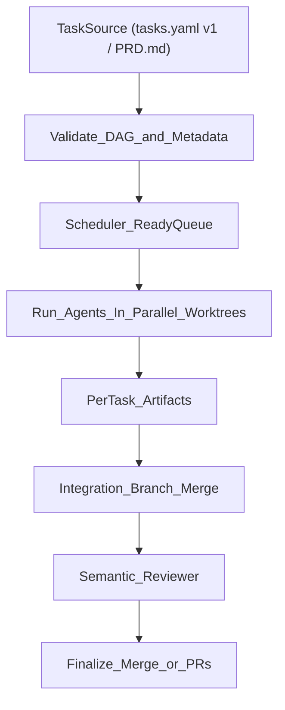

# GRALPH — Parallel AI coding runner (inspired by Ralph)


gralph is a fast, parallel AI coding runner. It was inspired by Ralph (credit where it's due), but Ralph felt too slow for real-world dev speed. gralph is an attempt to parallelize coding agents to satisfy one of the biggest developer needs today: writing AI slop fast, very fast.

## Overview

gralph reads tasks, schedules them with dependencies and mutexes, runs multiple agents in isolated git worktrees, and produces actionable artifacts (logs + reports). It aims to trade single-agent depth for throughput while keeping runs debuggable.

## Project status

This repo is in active development. The entrypoint script is `gralph.sh` and the rename to **GRALPH** is complete.

## Features

- DAG scheduling with `dependsOn` and `mutex`
- Parallel agents in isolated worktrees
- Task artifacts: JSON reports + logs
- External-failure fail-fast with graceful stop + timeout
- Auto-merge (or PRs) after successful runs
- Supports Claude Code, OpenCode, Codex, or Cursor

## How it works (end-to-end)

gralph’s “parallelism” is not “run everything at once”. It’s a **best-effort scheduler** that tries to maximize throughput while avoiding obvious conflicts:

- **Hard deps**: `dependsOn` edges form a DAG (task can’t run until deps are `done`).
- **Mutex locks**: tasks can declare shared resources (e.g. `lockfile`, `router`, `global-config`) so only one task holds that lock at a time.
- **Slot limit**: `--max-parallel N` caps concurrency even if many tasks are runnable.

High-level pipeline:



### 1) Task source

- **Recommended**: `tasks.yaml` v1. gralph treats this as the source of truth (updates `completed: true` when done).
- If you pass `--yaml <missing-file>`, gralph may generate tasks from a `PRD.md` in the current directory.

### 2) Scheduler model (what “parallel” means)

At any point in time a task is runnable (“ready”) only if:

- **All deps are done**: for every `dep` in `dependsOn`, `SCHED_STATE[dep] == done`
- **All mutexes are free**: none of its `mutex` entries are currently locked by another running task
- **There is a free slot**: current running < `--max-parallel`

If multiple tasks are ready, gralph starts up to `slots_available` of them.

This is intentionally simple:
- It prevents obvious shared-resource contention (e.g. two tasks rewriting the lockfile).
- It does **not** guarantee semantic compatibility across tasks (that’s why there is an integration + reviewer stage).

### 3) Execution model (worktrees + branches)

Each task runs in:
- a **fresh git worktree** (isolated filesystem)
- a **fresh branch** (typically `gralph/agent-<n>-<task-slug>`)

This gives “parallel write isolation”: agents don’t trample each other’s working directories.

### 4) Per-task gates (what counts as “done”)

A task only becomes “done” when the agent:
- produces **at least one commit**; otherwise it is marked `failed`
- produces artifacts (report + log) for debugging

### 5) Integration phase (merge attempt)

If you’re **not** using `--create-pr`, gralph attempts to merge completed task branches into an **integration branch** first.

- If merge conflicts happen, it attempts AI-assisted conflict resolution.
- Only after integration succeeds does it merge integration → base branch (e.g. `main`).

If you **are** using `--create-pr`, it keeps changes as PRs/branches instead of auto-merging.

### 6) Reviewer phase (design/semantic checks)

After merging into the integration branch, gralph runs a semantic reviewer that inspects:
- the integrated diff
- the per-task reports

Reviewer output is saved as `review-report.json`.

Important: by default the current gate treats only `severity == "blocker"` as a “stop the world” condition. If your reviewer uses `critical`/`warning`, the run may still pass unless you change that policy.

## Parallelism: what it can and can’t do

What it’s good at:
- Generating a lot of “slop” quickly across independent tasks
- Keeping tasks isolated (worktrees) so parallel edits don’t conflict at filesystem level
- Capturing artifacts to debug what happened per task

What it does not guarantee:
- No semantic conflicts (API contract mismatches across tasks)
- No merge conflicts (AI can attempt resolution, but it can still fail)
- Perfect task decomposition (bad DAG metadata will lead to poor scheduling)

## Install

```bash
git clone https://github.com/juanfra/central-ralph.git
cd central-ralph
chmod +x gralph.sh
```

### Requirements

Required:
- One of: [Claude Code CLI](https://github.com/anthropics/claude-code), [OpenCode CLI](https://opencode.ai/docs/), Codex CLI, or [Cursor](https://cursor.com) (`agent` in PATH)
- `jq`

Optional:
- `yq` (only if using YAML task files)
- `gh` (only if using GitHub Issues or `--create-pr`)
- `bc` (cost estimates)

## Skills

gralph uses “skills” as reusable instruction bundles per engine.

Install missing skills for your selected engine:

```bash
./gralph.sh --init
```

Skills currently used:
- `prd`
- `ralph`
- `task-metadata`
- `dag-planner`
- `parallel-safe-implementation`
- `merge-integrator`
- `semantic-reviewer`

## Quickstart

The intended workflow is:
1) Write a PRD (or provide a `tasks.yaml`), 2) run gralph, 3) inspect artifacts/branches, 4) merge/PR as needed.

```bash
./gralph.sh --yaml examples/personal-landing/tasks.yaml --parallel --opencode
```

If you pass a `--yaml` file that does not exist, gralph will try to generate it from a `PRD.md` in the current directory automatically.

### Recommended: tasks.yaml v1 (DAG + mutex)

Example:

```yaml
version: 1
tasks:
  - id: SETUP-001
    title: "Initialize project structure and dependencies"
    completed: false
    dependsOn: []
    mutex: ["lockfile"]
  - id: US-001
    title: "Build hero section"
    completed: false
    dependsOn: ["SETUP-001"]
    mutex: []
```

Full schema: `docs/tasks-yaml-v1.md`.

## Usage

```bash
# Example: run the included landing page tasks (YAML v1 + parallel)
./gralph.sh --yaml examples/personal-landing/tasks.yaml --parallel

# Use a specific engine
./gralph.sh --opencode --parallel

# Limit parallelism
./gralph.sh --parallel --max-parallel 2

# Run sequentially
./gralph.sh --yaml examples/personal-landing/tasks.yaml
```

## Configuration

Common flags (see `./gralph.sh --help` for the full list):

| Flag | Description |
| --- | --- |
| `--parallel` | Run tasks in parallel |
| `--max-parallel N` | Max concurrent agents (default: 3) |
| `--external-fail-timeout N` | Seconds to wait for running tasks after external failure (default: 300) |
| `--max-retries N` | Retries per task on failure |
| `--retry-delay N` | Delay between retries |
| `--create-pr` | Create PRs instead of auto-merge |
| `--dry-run` | Preview only |

## Artifacts

Each run creates `artifacts/run-YYYYMMDD-HHMM/`:

- `reports/<TASK_ID>.json` (task report)
- `reports/<TASK_ID>.log` (task log)
- `review-report.json` (if reviewer runs)

### Where is the code?

gralph runs tasks in **isolated git worktrees** and commits work to a **branch per task/agent**. Your current working tree will not change until merge/checkout.

To inspect the code for a completed task:
1) Open `artifacts/run-.../reports/<TASK_ID>.json` and copy the `branch`.
2) Checkout that branch:

```bash
git checkout <branch>
```

Or keep your current branch and use a worktree:

```bash
git worktree add ../wt-<task> <branch>
```

## Failure modes (quick)

- If a task fails due to an **external/toolchain** issue (example: install/tool not found/network), gralph will **stop scheduling new work**, wait for running tasks up to `--external-fail-timeout`, then terminate remaining tasks.
- If the scheduler has pending tasks but none are runnable, gralph reports a **deadlock** and prints which tasks are blocked and why.

## Contributing

PRs and issues welcome. Keep changes small, prefer clear logs and reproducible runs. If you add new failure modes or flags, update the README and tests.

## License

MIT

## Credits

gralph is inspired by Ralph, which pioneered the autonomous coding loop and PRD-driven task execution. This project builds on that idea with a focus on parallelism and throughput.
